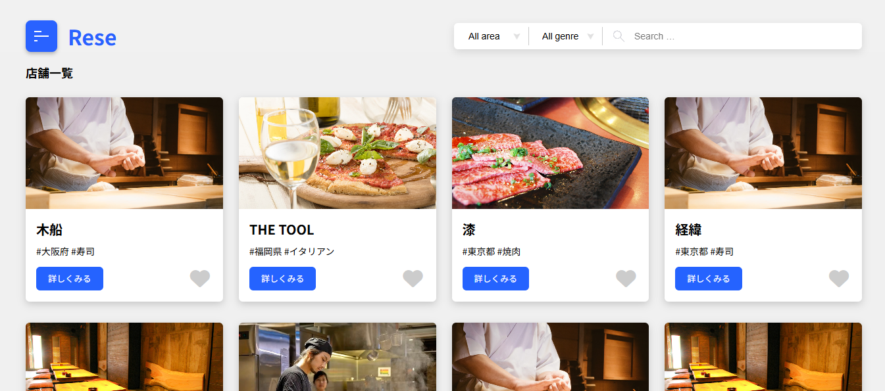
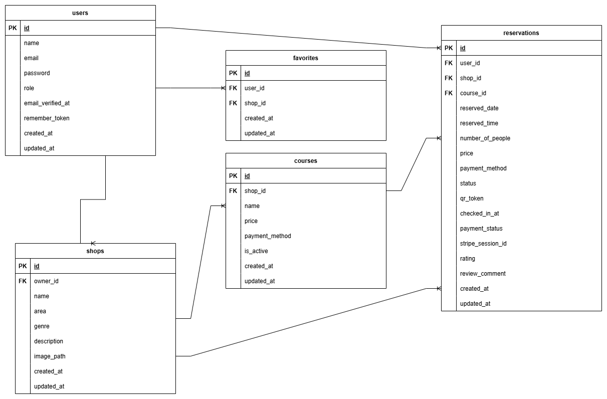

# rese（飲食店予約サービス）

## 1. アプリ概要・目的

### ■ アプリ概要
ある企業のグループ会社の飲食店予約サービス
rese は、飲食店の検索・予約・決済・来店管理をオンラインで一元管理できる飲食店予約サービスです。
ユーザーは店舗を検索してコースを選び、事前決済付きで予約できます。
店舗代表者は予約状況を管理し、QRコードによる来店チェックインや来店完了メールの送信ができます。

### ■ 作成した目的
外部の飲食店予約サービスは手数料を取られるので自社で予約サービスを持ちたい。
飲食店の予約業務を効率化し、利用者にとってもスムーズで安心な予約体験を提供することを目的として開発しました。

### ■ 店舗一覧画面

## アプリケーションURL

・開発環境: http://localhost/
・本番環境: http://35.78.207.37

・phpMyAdmin: http://localhost:8080

・Mailhog: http://localhost:8025

## 機能一覧

### User（利用者）
- 会員登録 / ログイン / ログアウト
- 飲食店一覧表示、詳細表示
- 条件検索（エリア / ジャンル / 店名）
- お気に入り登録/解除
- 予約作成・変更・キャンセル
- マイページで予約一覧確認
- 来店用QRの確認
- 決済（Stripe Checkout）

### Owner（店舗代表者）
- オーナーログイン
- 店舗情報の作成・編集
- 予約一覧の確認
- お知らせメール送信（店舗からユーザーへ）
- QR照合による来店チェックイン

### Admin（管理者）
- 管理者ログイン
- オーナー作成（Ownerアカウント発行）

### 【通知・メール】
- リマインダーメール送信

### 【システム】
- バリデーション（入力チェック）
- 認証（Laravel Fortify）
- ストレージ（画像アップロード）
- レスポンシブデザイン（PC / スマホ対応）

## 使用技術(実行環境)
- Laravel 8.75
- PHP 7.4.9
- MySQL 8.0.26
- Nginx 1.21.1
- phpMyAdmin（ポート8080で接続）
- Docker / Docker Compose v3.8
- AWS EC2（本番Webサーバ）
- AWS RDS（本番DB）
- AWS S3（店舗画像ストレージ）
- Mailhog（開発用メール）

## テーブル設計書

### usersテーブル

| Column            | Type            | PK | UK | NOT NULL | FK | Description             |
| ----------------- | --------------- | -- | -- | -------- | -- | ----------------------- |
| id                | unsigned bigint | ○  |    | ○        |    | User ID                 |
| name              | varchar(255)    |    |    | ○        |    | User name               |
| email             | varchar(255)    |    | ○  | ○        |    | Login email             |
| password          | varchar(255)    |    |    | ○        |    | Hashed password         |
| role              | enum            |    |    | ○        |    | user / owner / admin    |
| email_verified_at | timestamp       |    |    |          |    | Email verification time |
| remember_token    | varchar(100)    |    |    |          |    | Remember token          |
| created_at        | timestamp       |    |    |          |    |                         |
| updated_at        | timestamp       |    |    |          |    |                         |

### shopテーブル

| Column      | Type            | PK | UK | NOT NULL | FK        | Description        |
| ----------- | --------------- | -- | -- | -------- | --------- | ------------------ |
| id          | unsigned bigint | ○  |    | ○        |           | Shop ID            |
| owner_id    | unsigned bigint |    |    | ○        | users(id) | Shop owner         |
| name        | varchar(255)    |    |    | ○        |           | Shop name          |
| area        | varchar(255)    |    |    | ○        |           | Area               |
| genre       | varchar(255)    |    |    | ○        |           | Genre              |
| description | text            |    |    |          |           | Description        |
| image_path  | varchar(255)    |    |    |          |           | Image_path         |
| created_at  | timestamp       |    |    |          |           |                    |
| updated_at  | timestamp       |    |    |          |           |                    |

### favoritesテーブル

| Column     | Type            | PK | UK | NOT NULL | FK        | Description |
| ---------- | --------------- | -- | -- | -------- | --------- | ----------- |
| id         | unsigned bigint | ○  |    | ○        |           | Favorite ID |
| user_id    | unsigned bigint |    |    | ○        | users(id) | User        |
| shop_id    | unsigned bigint |    |    | ○        | shops(id) | Shop        |
| created_at | timestamp       |    |    |          |           |             |
| updated_at | timestamp       |    |    |          |           |             |

### coursesテーブル

| Column         | Type            | PK | UK | NOT NULL | FK        | Description    |
| -------------- | --------------- | -- | -- | -------- | --------- | -------------- |
| id             | unsigned bigint | ○  |    | ○        |           | Course ID      |
| shop_id        | unsigned bigint |    |    | ○        | shops(id) | Shop           |
| name           | varchar(255)    |    |    | ○        |           | Course name    |
| price          | int             |    |    | ○        |           | Price          |
| payment_method | enum            |    |    | ○        |           | credit / cash  |
| is_active      | boolean         |    |    | ○        |           | On sale or not |
| created_at     | timestamp       |    |    |          |           |                |
| updated_at     | timestamp       |    |    |          |           |                |

### reservationsテーブル

| Column            | Type            | PK | UK | NOT NULL | FK          | Description                   |
| ----------------- | --------------- | -- | -- | -------- | ----------- | ----------------------------- |
| id                | unsigned bigint | ○  |    | ○        |             | Reservation ID                |
| user_id           | unsigned bigint |    |    | ○        | users(id)   | User                          |
| shop_id           | unsigned bigint |    |    | ○        | shops(id)   | Shop                          |
| course_id         | unsigned bigint |    |    |          | courses(id) | Course                        |
| reserved_date     | date            |    |    | ○        |             | Reserved date                 |
| reserved_time     | time            |    |    | ○        |             | Reserved time                 |
| number_of_people  | tinyint         |    |    | ○        |             | Number of people              |
| price             | int             |    |    |          |             | Final price                   |
| payment_method    | enum            |    |    |          |             | credit / cash                 |
| status            | enum            |    |    | ○        |             | reserved / canceled / visited |
| qr_token          | varchar(64)     |    | ○  | ○        |             | Used for QR check-in          |
| checked_in_at     | timestamp       |    |    |          |             | Visit time                    |
| payment_status    | enum            |    |    | ○        |             | unpaid / paid                 |
| stripe_session_id | varchar(255)    |    | ○  |          |             | Stripe checkout session       |
| rating            | tinyint         |    |    |          |             | 1–5 stars                     |
| review_comment    | text            |    |    |          |             | Review                        |
| created_at        | timestamp       |    |    |          |             |                               |
| updated_at        | timestamp       |    |    |          |             |                               |

## ER図

## 環境構築

### Docker ビルド

1.リポジトリをクローン
git clone https://github.com/hirata21/rese.git

2.DockerDesktop アプリを立ち上げる

3.docker-compose up -d --build

### Laravel 環境構築

1.docker-compose exec php bash

2.composer install

3.「.env.example」ファイルを 「.env」ファイルに命名を変更。
cp .env.example .env

4..env に以下の環境変数を追加

データベース
- DB_CONNECTION=mysql
- DB_HOST=mysql
- DB_PORT=3306
- DB_DATABASE=laravel_db
- DB_USERNAME=laravel_user
- DB_PASSWORD=laravel_pass

メール（開発環境：Mailhog）
- MAIL_MAILER=smtp
- MAIL_HOST=mailhog
- MAIL_PORT=1025
- MAIL_USERNAME=null
- MAIL_PASSWORD=null
- MAIL_ENCRYPTION=null
- MAIL_FROM_ADDRESS=no-reply@example.test
- MAIL_FROM_NAME="${APP_NAME}"

ストレージ（開発環境）
- FILESYSTEM_DISK=public

Stripe（決済）
- STRIPE_KEY=your_stripe_public_key
- STRIPE_SECRET=your_stripe_secret_key
※ Stripeのキーは 各自のStripeダッシュボードで取得した値 を設定してください。

5.アプリケーションキーの作成
php artisan key:generate

6.マイグレーションの実行
php artisan migrate

7.シーディングの実行
php artisan db:seed

8.ストレージリンクの作成
php artisan storage:link

9.権限（必要なとき）
chown -R www-data:www-data storage bootstrap/cache
chmod -R ug+rwx storage bootstrap/cache

## 本番環境（AWS .env 設定）
※ 値は各自の環境に合わせて設定してください。

アプリケーション
- APP_ENV=production
- APP_DEBUG=false
- APP_URL=http://35.78.207.37

データベース
- DB_CONNECTION=mysql
- DB_HOST=your-rds-endpoint
- DB_PORT=3306
- DB_DATABASE=your_database_name
- DB_USERNAME=your_db_user
- DB_PASSWORD=your_db_password

ストレージ（S3）
- FILESYSTEM_DISK=s3
- AWS_ACCESS_KEY_ID=your-access-key
- AWS_SECRET_ACCESS_KEY=your-secret-key
- AWS_DEFAULT_REGION=ap-northeast-1
- AWS_BUCKET=your-s3-bucket-name
- AWS_URL=https://your-s3-bucket.s3.ap-northeast-1.amazonaws.com

Stripe（決済）
- STRIPE_KEY=your_stripe_public_key
- STRIPE_SECRET=your_stripe_secret_key

## 開発用ログインアカウント

以下のユーザーは `php artisan db:seed` で自動作成されます。

### 管理者
name: 管理者
email: admin@example.com
password: admin123

### オーナー
- name: オーナー1
- email: owner1@example.com
- password: owner123

- name: オーナー2
- email: owner2@example.com
- password: owner123

- name: オーナー3
- email: owner3@example.com
- password: owner123

### 一般ユーザー
ユーザーは **user1〜user10** を用意しています。

- email: `user{n}@example.com`（n = 1〜10）
- password: `password`
- name: `ユーザー{n}`

## PHPUnit テストについて

//テスト用データベースの作成

docker-compose exec mysql bash

mysql -u root -p

//パスワードはrootと入力

create database test_database;

//.env.testingの作成

docker-compose exec php bash

cp .env .env.testing

APP_ENV=test

DB_DATABASE=test_database

DB_USERNAME=root

DB_PASSWORD=root

php artisan key:generate --env=testing

php artisan config:clear

php artisan migrate:fresh --env=testing

php artisan test

※.env.testingにもmailhogの設定をしてください。